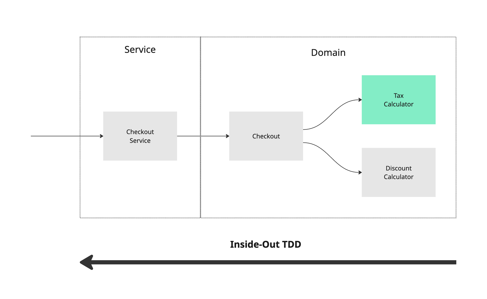
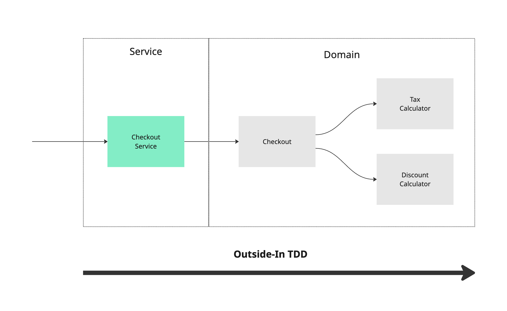

# Test-Driven Development (TDD)

At its core, TDD simply means writing tests before you write software.

### How to use TDD

When faced with a new software requirement, before diving into the implementation, take some time to think about how the problem can be broken down into bite-size requirements which we can write tests for.

Whether you have a clear route in your head, or you only have the first requirement, TDD will work for both approaches.

The process, known as `Red-Green-Refactor` is as follows:

1. Write the simplest test for the simplest requirement you can think of and watch it fail (Red)
2. Write the smallest amount of code to make the test pass (Green). Do **not** optimise too early. Remember YAGNI (You ain't gonna need it)
3. Once all tests are green. Look for optimisations you can make and refactor.
4. Repeat

### Why use TDD?

Writing tests before we write software forces us to think about our code in a particular way. It forces you to think of the problems you need to solve before you think about the solution.

After all, we write software to satisfy a set of requirements, so why not start with the requirements driving the software?

Another great benefit of TDD is that you are forced to write your software in a testable way from the start. Have you ever written an entire feature and then come to write unit tests only to question "How the heck do I test this?".

### Should I always use TDD?

TDD can be used in most scenarios but there is no mandate for where and when you must use it. After some practice, the benefits and the strengths should become clear, and it should be another tool you can choose to use wherever it applies.

### Styles of TDD

There are a couple of styles of TDD that take slightly different approaches.

#### Inside-Out (Classicist TDD)

Inside-out is often the default way alot of engineers approach TDD. You start with a small piece of functionality that is easy to describe and draw-up requirements for. You then work your way out from the most specific part of the system, up to the external-facing interfaces of the system.

The diagram below attempts to illustrate how this might looks for a `Checkout` service. The `Checkout` is used across the codebase as a re-usable domain service, but it may also be made up of other components like a `TaxCalculator` or a `DiscountCalculator`.

Using Inside-out, you might pick a specific piece of functionality that you have set requirements for, and work your way up to the more generic interface (right-to-left).

Inside-out focuses on the functionality of each component. This also lends itself to being able to easily build-up integration tests between components.

#### Outside-In (Mockist TDD)

Outside-in takes the reverse approach to writing software. Everything is still TDD, but you start from the perspective of user behavior and business outcomes, rather than specific functionality.

Outside-in uses a lot of the principles of Behaviour-Driven Design (BDD) which focuses on collaboration, clear specifications, and user-centric behavior.

The issue you'll quickly find with Outside-in, is that the lower-level functions are not yet defined. This is where the style gets the `Mockist` name from.

Outside-in focuses on the collaboration that happens between components.

#### Comparing TDD styles

The primary difference between the two approaches is how you arrive at the more generic interface.

There is no right or wrong approach. In fact, a combination of the 2 can often be useful.

| Inside-Out | Outside-In |
| ---------- | ---------- |
| Start with small functions (unit tests) | Start with a public API (behavior-driven) |
| Build larger pieces using tested small units | Write tests for the desired behavior first |
| Integration happens naturally | Fill in the internal logic as needed |
